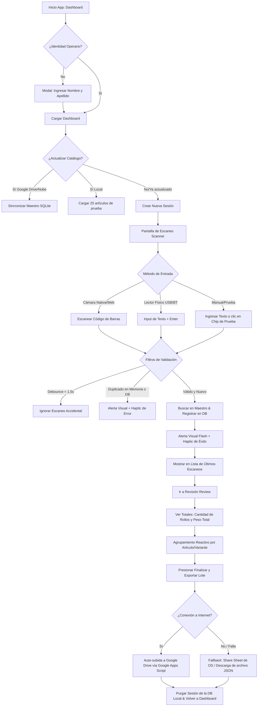

# Resumen Funcional y Especificaciones Técnicas
## Proyecto: Control de Stock Industrial MVP (Offline-First Barcode Scanner)

Este documento resume el funcionamiento general, flujo del usuario, arquitectura de software y las especificaciones técnicas detalladas del sistema **Control de Stock Industrial MVP**.

---

## 1. Resumen Funcional

El sistema es una aplicación móvil offline-first (con compatibilidad web de prueba) diseñada para la captura e inventariado rápido de mercancías mediante escaneo de códigos de barra en entornos industriales. Su principal propuesta de valor es la operación autónoma (sin conexión a internet estable) garantizando la integridad de los datos a nivel de dispositivo antes de su consolidación en la nube.

### 1.1 Flujo del Usuario (UX)



#### Paso 1: Configuración de Identidad y Sincronización
- **Identificación del operario**: Al iniciar por primera vez, un modal solicita el nombre y apellido del usuario. Esta identidad se guarda localmente en la base de datos y se adjunta en la cabecera de todas las exportaciones.
- **Sincronización del Catálogo Maestro**: El Dashboard permite sincronizar más de 20,000 artículos desde un CSV hospedado en Google Drive. Para ahorrar datos, primero consulta si existen modificaciones (`?action=check`) y solo realiza la descarga (`?action=download`) si es necesario. También posee un fallback para cargar un catálogo embebido de prueba de 25 artículos.

#### Paso 2: Escaneo en Tiempo Real (`ScannerScreen`)
- **Operación Multicanal**: Soporta escaneo con cámara nativa (mediante `expo-camera`), cámara web (a través de `html5-qrcode` para pruebas de escritorio), pistolas lectoras USB/Bluetooth (mediante un campo de texto oculto/enfocado con envío por retorno) y botones rápidos con códigos mock.
- **Prevención de Errores e Integridad**:
  - **Debounce de 1.5s**: Evita lecturas accidentales seguidas.
  - **Doble validación de duplicados**: Realiza una comprobación instantánea en memoria (`Set` de JavaScript) y una validación de respaldo en la base de datos local SQLite para evitar escaneos repetidos en la misma sesión.
  - **Feedback Háptico y Visual**: Emite vibraciones físicas distintivas en dispositivos móviles (vibración corta para éxito, doble vibración de error para duplicados) y despliega una animación tipo flash de color en pantalla (verde = hidratado, naranja = no encontrado/pendiente, rojo = duplicado).

#### Paso 3: Revisión y Consolidación (`ReviewScreen`)
- Muestra métricas agregadas globales de la sesión actual: cantidad total de rollos escaneados y la sumatoria de peso acumulado.
- Presenta el listado agrupado reactivamente por código de artículo, indicando la descripción, el color de la variante, la cantidad de unidades/rollos en ese grupo y el peso acumulado por ítem.

#### Paso 4: Finalización y Exportación
- Compila un payload estructurado JSON atómico.
- **Intento de Envío Directo**: Trata de subir el JSON a la carpeta configurada en Google Drive enviando un POST HTTP a la API de Google Apps Script.
- **Plan de Respaldo Offline (Fallback)**: Si el dispositivo está desconectado o la API falla, despliega el panel nativo de compartir (`Share Sheet`) para enviar el archivo `.json` por email, mensajería instantánea o guardarlo localmente. En web, se descarga automáticamente en el navegador.
- **Limpieza (Purga)**: Una vez confirmado el envío/exportación exitoso, los escaneos de la sesión actual se purgan de la tabla SQLite local para liberar almacenamiento y preparar el dispositivo para un nuevo ciclo de conteo.

---

## 2. Especificaciones Técnicas

### 2.1 Stack Tecnológico y Dependencias
El MVP está desarrollado sobre un entorno móvil multiplataforma usando:
- **Framework Principal**: Expo SDK 54.0.0 (React Native 0.81.5)
- **Lenguaje**: TypeScript 5.9.2
- **Base de Datos Local**: `expo-sqlite` (v16.0.10) para persistencia e indexación rápida.
- **Diseño y Estilos**: NativeWind (v4.2.3) con Tailwind CSS (v3.3.2) y estilos personalizados para máxima flexibilidad.
- **Cámara**: `expo-camera` (v17.0.10) en dispositivos nativos y `html5-qrcode` (v2.3.8) para el módulo web.
- **Navegación**: React Navigation v7 (`@react-navigation/native` y `@react-navigation/native-stack`).
- **Retroalimentación Física**: `expo-haptics` (v15.0.8).
- **Manejo de Archivos y Compartir**: `expo-file-system` (v19.0.21) y `expo-sharing` (v14.0.8).

---

### 2.2 Estructura y Esquema de la Base de Datos Local (SQLite)

La persistencia de datos local corre sobre una base de datos SQLite denominada `control_stock.db`. Contiene tres tablas principales indexadas para agilizar las búsquedas en catálogos extensos:

```sql
-- 1. Tabla de Catálogo Maestro (Artículos importados)
CREATE TABLE IF NOT EXISTS master_stock (
  id_barra      TEXT PRIMARY KEY,  -- Código de barras físico del rollo (PK)
  cod_articulo  TEXT NOT NULL,     -- Identificador único del tipo de artículo
  descripcion   TEXT,              -- Nombre/descripción detallada
  peso_nominal  REAL DEFAULT 0,    -- Peso nominal en kilogramos
  color         TEXT,              -- Variante de color
  last_updated  TEXT               -- Marca de tiempo ISO8601 de la sincronización
);

-- Índices en master_stock para consultas en milisegundos durante el escaneo
CREATE INDEX IF NOT EXISTS idx_master_id_barra ON master_stock(id_barra);
CREATE INDEX IF NOT EXISTS idx_master_cod_articulo ON master_stock(cod_articulo);

-- 2. Tabla de Escaneos de Sesiones Activas
CREATE TABLE IF NOT EXISTS session_scans (
  id_barra        TEXT NOT NULL,        -- Código de barras escaneado
  scan_timestamp  TEXT NOT NULL,        -- Timestamp del momento de lectura (ISO8601)
  session_id      TEXT NOT NULL,        -- UID autogenerado de la sesión de trabajo
  status          TEXT DEFAULT 'pending', -- Estado del escaneo ('hydrated' | 'pending' | 'error')
  PRIMARY KEY (id_barra, session_id)    -- Llave compuesta: impide duplicados por sesión
);

-- Índice en session_scans para agrupar rápidamente por sesión
CREATE INDEX IF NOT EXISTS idx_session_scans_session ON session_scans(session_id);

-- 3. Tabla de Metadatos de Sincronización
CREATE TABLE IF NOT EXISTS sync_meta (
  key   TEXT PRIMARY KEY,               -- Identificador de propiedad ('last_sync', 'cloud_last_updated')
  value TEXT                            -- Valor registrado
);
```

---

### 2.3 Servicios Principales (`src/services/`)

#### 1. Sync Engine ([syncService.ts](file:///c:/Antigravity/Control_Stock/src/services/syncService.ts))
Encargado de la ingesta masiva de datos en la base de datos SQLite local:
- **Procesamiento de Lotes (Batching)**: Para evitar bloqueos en el hilo principal de la interfaz de usuario al procesar más de 20,000 registros, la inserción se divide en lotes controlados de 500 registros (`BATCH_SIZE = 500`) encapsulados dentro de transacciones SQLite ACID (`db.withTransactionAsync`).
- **Integridad**: Utiliza la cláusula `INSERT OR REPLACE` para asegurar la actualización de artículos existentes sin colisionar con claves primarias anteriores.

#### 2. Hydration Service ([hydrationService.ts](file:///c:/Antigravity/Control_Stock/src/services/hydrationService.ts))
Responsable de enriquecer la información cruda del código de barras con los detalles de catálogo:
- Realiza un `SELECT` directo en la tabla `master_stock` utilizando `id_barra` indexado.
- Si el artículo existe, se inserta en `session_scans` con estado `'hydrated'` y se retornan sus datos nominales (código, descripción, peso, color).
- Si no existe, se registra temporalmente en la base de datos con el estado `'pending'` para no frenar la jornada laboral del operario (permitiendo revisiones posteriores).

#### 3. Aggregation Engine ([aggregationService.ts](file:///c:/Antigravity/Control_Stock/src/services/aggregationService.ts))
Provee consultas agregadas reactivas a la vista de revisión (`ReviewScreen`):
- Agrupa los escaneos de la sesión agrupándolos por `cod_articulo` y calcula la sumatoria total de unidades y peso:
  ```sql
  SELECT 
    COALESCE(m.cod_articulo, 'SIN_CODIGO') as cod_articulo,
    COALESCE(m.descripcion, 'Artículo Desconocido') as descripcion,
    COUNT(s.id_barra) as total_units,
    COALESCE(SUM(m.peso_nominal), 0) as total_weight,
    COALESCE(m.color, '-') as color
  FROM session_scans s
  LEFT JOIN master_stock m ON s.id_barra = m.id_barra
  WHERE s.session_id = ?
  GROUP BY m.cod_articulo
  ORDER BY total_units DESC
  ```

#### 4. Export Handler ([exportService.ts](file:///c:/Antigravity/Control_Stock/src/services/exportService.ts))
Construye y despacha el lote de datos al finalizar una sesión de conteo.
- **Estructuración Atómica**: Agrupa la información en un único archivo de carga estructurado que incluye metadatos del dispositivo, datos del operario, un resumen consolidado por artículo con el listado de rollos asociados, y el registro de escaneos plano e independiente.
- **Auto-guardado en Nube y Compartido**: Interactúa con la API Cloud y delega al sistema operativo nativo el compartición en caso de error de red.
- **Purgado de Sesión**: Ejecuta un comando `DELETE` sobre `session_scans` filtrando por el identificador de sesión una vez finalizado el despacho con éxito.

---

### 2.4 Esquemas de Datos (JSON)

#### Formato del Maestro de Artículos (CSV)
El catálogo se importa desde archivos delimitados por comas bajo el siguiente formato de encabezados:
```csv
id_barra,cod_articulo,descripcion,peso_nominal,color
7790001000011,ALG-BLA,Algodón Blanco,12.5,Blanco
7790001000042,ALG-NEG,Algodón Negro,10.0,Negro
```

#### Formato de Exportación de Lotes (Payload JSON)
Al finalizar la sesión, se genera un archivo estructurado como el siguiente:
```json
{
  "header": {
    "device_id": "DEVICE_001",
    "user": "Juan Pérez",
    "session_id": "ses_1716676239102_a8f9z2",
    "timestamp": "2026-05-26T00:07:32.000Z"
  },
  "summary": [
    {
      "cod_articulo": "ALG-BLA",
      "descripcion": "Algodón Blanco",
      "color": "Blanco",
      "total_units": 2,
      "total_weight": 24.3,
      "rollos": [
        {
          "id_barra": "7790001000011",
          "peso": 12.5
        },
        {
          "id_barra": "7790001000028",
          "peso": 11.8
        }
      ]
    }
  ],
  "raw_data": [
    {
      "id_barra": "7790001000011",
      "cod_articulo": "ALG-BLA",
      "peso": 12.5,
      "color": "Blanco"
    },
    {
      "id_barra": "7790001000028",
      "cod_articulo": "ALG-BLA",
      "peso": 11.8,
      "color": "Blanco"
    }
  ]
}
```

---

### 2.5 Integración de Nube con Google Apps Script ([Codigo_Google_Script.js](file:///c:/Antigravity/Control_Stock/Codigo_Google_Script.js))

Se utiliza un script de servidor de Apps Script publicado como Web App para intermediar de forma gratuita entre la base de datos física del dispositivo móvil y las carpetas de Google Drive de la organización.

- **`doPost(e)`**:
  - Recibe el JSON de exportación del dispositivo.
  - Genera y nombra el archivo dinámicamente con la convención: `Export_[FECHA]_[OPERARIO]_[SESSION_ID_CORTO].json`.
  - Guarda el archivo en la carpeta asignada mediante su ID exclusivo en Drive (`JSON_FOLDER_ID`).
- **`doGet(e)`**:
  - Busca el archivo de catálogo CSV más actualizado en la carpeta (`DB_FOLDER_ID`).
  - **`action=check`**: Retorna un objeto JSON ligero que incluye la marca de tiempo de la última modificación (`lastUpdated`) y el nombre del archivo para validar si el dispositivo móvil necesita sincronizar.
  - **`action=download`**: Descarga y transmite el flujo completo de texto del archivo CSV para guardarlo localmente en la base de datos SQLite.

---

### 2.6 Integración Local con VB6 (Google Drive para Ordenadores + Script Puente)

Para comunicar el sistema heredado en Visual Basic 6 (VB6) con los datos guardados en la nube sin requerir integraciones complejas de red o APIs en VB6:

1. **Google Drive para Ordenadores (Desktop)**: Se instala en el equipo supervisor local. Sincroniza en tiempo real la carpeta cloud de Drive (`JSON_FOLDER_ID`) con una ruta local de Windows (ej. `G:\Mi unidad\ControlStock\JSONs`).
2. **Script Puente Local**: Un script en segundo plano (Python/Node/C#) monitorea la carpeta local de Drive. Al detectar un archivo `.json` de exportación:
   - Parsea el contenido JSON.
   - Genera una versión aplanada en formato **CSV** en una ruta de importación local (ej. `C:\ControlStock\Import\`) o realiza la inserción directa en la base de datos local (SQL Server / Access).
   - Mueve el `.json` original a una carpeta `Procesados/` dentro de la unidad de Drive para archivarlo.
3. **VB6**: Consume los archivos CSV planos generados o lee los registros insertados en la base de datos mediante procesos estándar y livianos.

